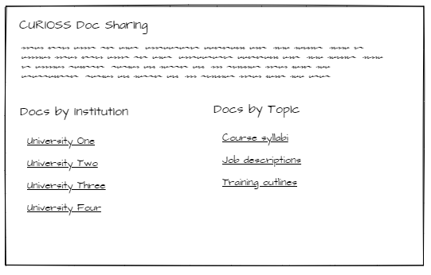
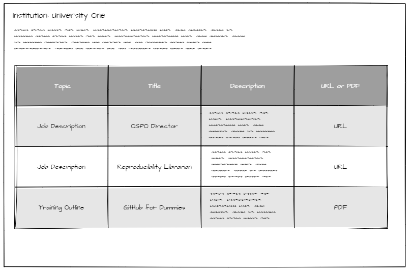

*No frontmatter on this page intentionally to not render in the generated site*

Proof of concept site for OSPO website.

> Basic idea – a page where the dozen + academic institutions with OSPOs can post docs to share with one another. Examples would be job descriptions, course syllabi, useful slide decks, etc. I think we could limit docs to PDFs and links/URLs.
>
> It would be great if we had a template that folks could fork, update w/their doc’s details, and then submit a pull request.
>
> Bonus points: A single page/pull request would populate two places – a landing page for the org itself, and then a landing page for the topic (e.g. job description). Not sure if that’s something that can be done if we use standard terminology in the YAML frontmatter?
>
> GitHub is attractive because we can all be committers, no cost, and it wouldn’t need to be “owned” by any one organization.
>
> Here are a few wireframes (using the term very loosely) so you can see what I mean – Home page, Member page, Topic page

## Dependencies

* PicoCSS (https://picocss.com/) : trying this minimal CSS framework so I don't have to mess with Bootstrap
