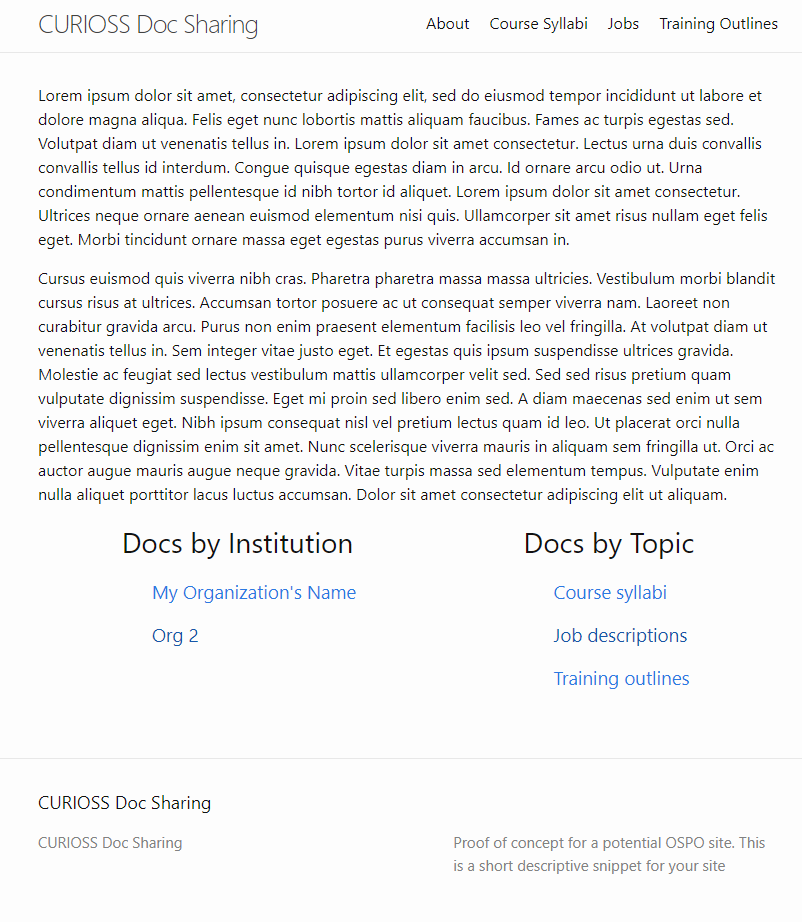
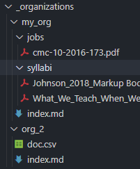

This is a proof of concept Jekyll site that could consolidate documents for different topics across institutions. In this configuration, organizations are treated as Jekyll collections that contain their own set of documents. An organization level markdown page will contain information along with data in a shared "organizations.yml" data document to describe the documents.

<!--  -->

## Add your institution's documents

Create a new folder for your organization in the `_organizations/` directory and add your documents to that folder. You can separate your documents into separate folders according to topic if you want, but that is not required.

In your organization folder, create a filed called `index.md`. This will serve as your organization page in this site.



Your organizations `index.md` will need to look like:

``` md
---
layout: orgs_page
title: My Organization's Name
org_id: my_org_id
---

Optionally add text here and it will appear on the organization's page above.

Above, in the section between the `---`

- `layout`: orgs_page` must be this value
- `title`: feel free to change this value. It will appear as the page header
- `org_id`: you'll need to change this so it's unique among all organizations on the site. This is used to pull data describing files in `_data/organizations.yml`

```

### Add/update organization file descriptions

The files are described by [`_data/organizations.yml`](https://github.com/jabrah/ospo-site-poc/blob/main/_data/organizations.yml). This file is a YML list of organizations, where each organization has a list of topics, among other data. The `organization` value MUST match the `org_id` value in your `index.md` file.

Valid topics currently:
* `Job description`
* `Course Syllabus`
* `Training outlines`

``` yml
- organization: my_org_id
  name: This name shows up in tables
  topics:
    - topic:
      title:
      url: organizations/my_org/<path-to-file>
      description: File description. You can use multiple lines using YML https://yaml-multiline.info/
```

File description properties:
* `topic`: topic identifier. Used by individual topic pages, such as `pages/job_descriptions.md`
* `url`: URL to resolve the file being described. It should always start with `organizations/<org>` where the `<org>` is the folder name. `<path-to-file>` refers to where the file can be found within your organization folder
* `title`
* `description`

## Publish

Once valid changes are merged into the `main` branch, GitHub will automatically build and publish changes

## Testing

You can test your changes locally by running Jekyll on your machine to build and locally serve the site.

Requirements:

- Ruby (validated with v3.2.2)
- bundle (Ruby build tool)

``` sh
bundle install # Install dependencies
bundle exec jekyll serve
```

After running this, Jekyll will build the site and serve it at `http://127.0.0.1:4000/ospo-site-poc/`
